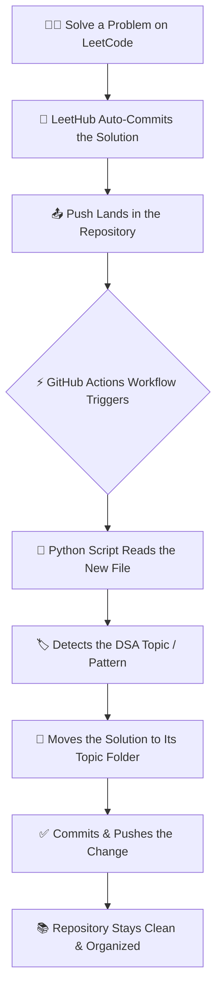

<div align="center">

# 🧠 LeetCode Solutions Vault

### A Self-Organizing Archive of DSA Practice in C++

</div>

This repository holds my LeetCode solutions, written in C++, as I work through data structures and algorithms on the way to a Software Engineering role. Every solution I push is picked up automatically by a GitHub Actions + Python pipeline and filed into its correct topic folder — no manual sorting, ever. The result is a repository built to grow to hundreds of problems while staying clean, browsable, and easy for anyone — recruiters included 👀 — to explore.

<div align="center">


[](https://leetcode.com/u/sumitsaini03/)


</div>

---

## 📋 Table of Contents

- [✨ Features](#-features)
- [📁 Repository Structure](#-repository-structure)
- [🤖 How the Automation Works](#-how-the-automation-works)
- [🧩 System Architecture](#-system-architecture)
- [🧰 Technology Stack](#-technology-stack)
- [🔄 GitHub Actions Workflow](#-github-actions-workflow)
- [🤝 Contributing](#-contributing)
- [🎯 Repository Goals](#-repository-goals)
- [📊 Progress Tracking](#-progress-tracking)
- [🚀 Future Improvements](#-future-improvements)
- [📜 License](#-license)
- [🙏 Acknowledgements](#-acknowledgements)

---

## ✨ Features

|  | Feature | Description |
|:---:|---|---|
| 🤖 | **Fully Automated Categorization** | Every pushed solution is analyzed and filed into its correct DSA topic folder — no manual sorting. |
| ⚡ | **Zero-Maintenance Pipeline** | A GitHub Actions workflow handles organization on every push, quietly, in the background. |
| 📈 | **Built to Scale** | A folder-per-topic structure designed to stay clean across hundreds of problems. |
| 🧠 | **Interview-Style C++** | Every solution is written in modern, readable C++ suited for technical interviews. |
| 🗂️ | **Instantly Browsable** | Recruiters, collaborators, or future me can find any topic in a single click. |
| 🌱 | **Continuously Growing** | New topics and folders are added automatically as practice expands. |

<div align="right"><sub><a href="#-table-of-contents">⬆ back to top</a></sub></div>

## 📁 Repository Structure

```
leetcode-solutions/
├── Arrays/
│   ├── 1-two-sum.cpp
│   ├── 15-three-sum.cpp
│   └── 42-trapping-rain-water.cpp
├── Binary Search/
├── Backtracking/
├── Bit Manipulation/
├── Dynamic Programming/
├── Graphs/
├── Greedy/
├── Hashing/
├── Linked List/
├── Math/
├── Queue/
├── Recursion/
├── Sliding Window/
├── Stack/
├── Strings/
├── Trees/
├── Two Pointers/
├── Trie/
├── Heap/
├── Prefix Sum/
├── Binary Tree/
├── BST/
│
├── scripts/
│   └── categorize.py        # Core categorization logic
│
├── .github/
│   └── workflows/
│       └── organize.yml     # Automation entry point
│
└── README.md
```

> [!NOTE]
> New topic folders are created automatically the first time a problem from that category is solved — the list above will keep growing.

<div align="right"><sub><a href="#-table-of-contents">⬆ back to top</a></sub></div>

## 🤖 How the Automation Works

This repository turns a simple habit — *solve, submit, push* — into a fully organized archive, with no manual filing required.

1. **Solve** a problem on LeetCode and get it accepted.
2. **LeetHub** (a browser extension) automatically commits the accepted solution to this repository.
3. The push **triggers a GitHub Actions workflow**.
4. A **Python script** reads the newly added file and determines its DSA topic.
5. The script **moves the solution** into the matching topic folder, creating a new one if needed.
6. The workflow **commits and pushes** the reorganized structure back — automatically.

> [!NOTE]
> The only manual step in this entire loop is solving the problem itself. Everything from commit to categorization happens without touching the keyboard again.

<div align="right"><sub><a href="#-table-of-contents">⬆ back to top</a></sub></div>

## 🧩 System Architecture



<div align="right"><sub><a href="#-table-of-contents">⬆ back to top</a></sub></div>

## 🧰 Technology Stack

| Category | Technology | Purpose |
|---|---|---|
| 💻 Language | C++ (17) | Writing clean, interview-ready solutions |
| 🐍 Automation | Python 3 | Parsing, categorizing, and organizing solutions |
| ⚡ CI/CD | GitHub Actions | Running the categorization pipeline on every push |
| 🔌 Integration | LeetHub | Auto-committing accepted solutions from LeetCode |
| 🗃️ Version Control | Git & GitHub | Hosting, history, and collaboration |

<div align="right"><sub><a href="#-table-of-contents">⬆ back to top</a></sub></div>

## 🔄 GitHub Actions Workflow

Every push to `main` runs a lightweight workflow that keeps the repository self-organizing:

| Step | What Happens |
|---|---|
| **Trigger** | Fires on every `push` to the `main` branch |
| **Checkout** | Pulls the full repository history |
| **Setup** | Installs the required Python runtime |
| **Categorize** | Runs the script that sorts new solutions into topic folders |
| **Commit & Push** | Pushes the reorganized files back automatically |

> [!IMPORTANT]
> The workflow needs `contents: write` permission (or a personal access token) to commit changes back to the repository — without it, GitHub Actions can read the repo but can't push updates to it.

<details>
<summary><strong>📄 View an example workflow file</strong></summary>

```yaml
name: Organize LeetCode Solutions

on:
  push:
    branches: [main]

permissions:
  contents: write

jobs:
  organize:
    runs-on: ubuntu-latest
    steps:
      - name: Checkout repository
        uses: actions/checkout@v4
        with:
          fetch-depth: 0

      - name: Set up Python
        uses: actions/setup-python@v5
        with:
          python-version: "3.x"

      - name: Run categorization script
        run: python scripts/categorize.py

      - name: Commit and push changes
        run: |
          git config user.name "github-actions[bot]"
          git config user.email "github-actions[bot]@users.noreply.github.com"
          git add .
          git diff --quiet && git diff --staged --quiet || git commit -m "chore: auto-organize solutions [skip ci]"
          git pull --rebase origin main
          git push
```

</details>

<div align="right"><sub><a href="#-table-of-contents">⬆ back to top</a></sub></div>

## 🤝 Contributing

This is primarily a personal practice log, but improvements to the tooling, automation, or docs are always welcome.

1. Fork the repository
2. Create a feature branch — `git checkout -b feature/your-idea`
3. Make your changes
4. Commit with a clear message
5. Open a Pull Request describing what changed and why

**Ideas worth contributing:**
- Improving the categorization logic in `scripts/categorize.py`
- Handling new or ambiguous DSA topics more gracefully
- Improving this README or adding documentation
- Reporting bugs or edge cases via Issues

> [!TIP]
> For larger changes, open an issue first — it helps keep contributions aligned with the repository's automation-first design.

<div align="right"><sub><a href="#-table-of-contents">⬆ back to top</a></sub></div>

## 🎯 Repository Goals

- 📌 Build a durable, consistent DSA practice habit — one push at a time
- 🗂️ Stay organized at 500+ problems without any manual folder management
- 👀 Give recruiters and interviewers a clean, browsable trail of consistent practice
- 🚀 Support the transition from an engineering degree into a Software Engineering role
- 🤖 Explore how small, well-scoped automation can remove repetitive developer chores
- 📈 Keep the structure scalable, so growth never means clutter

<div align="right"><sub><a href="#-table-of-contents">⬆ back to top</a></sub></div>

## 📊 Progress Tracking

| Topic | Problems Solved |
|---|:---:|
| Arrays | 0 |
| Binary Search | 0 |
| Backtracking | 0 |
| Bit Manipulation | 0 |
| Dynamic Programming | 0 |
| Graphs | 0 |
| Greedy | 0 |
| Hashing | 0 |
| Linked List | 0 |
| Math | 0 |
| Queue | 0 |
| Recursion | 0 |
| Sliding Window | 0 |
| Stack | 0 |
| Strings | 0 |
| Trees | 0 |
| Two Pointers | 0 |
| Trie | 0 |
| Heap | 0 |
| Prefix Sum | 0 |
| Binary Tree | 0 |
| BST | 0 |
| **Total** | **0** |

> [!TIP]
> This table is a living scoreboard. Update it by hand, or automate it — see [Future Improvements](#-future-improvements).

<div align="right"><sub><a href="#-table-of-contents">⬆ back to top</a></sub></div>

## 🚀 Future Improvements

- [ ] Auto-generate the progress table via a script that counts files per folder
- [ ] Tag each solution with difficulty (Easy / Medium / Hard)
- [ ] Add time & space complexity notes to every solution
- [ ] Add a dedicated `CONTRIBUTING.md`
- [ ] Add tests for the categorization script
- [ ] Track LeetCode contest performance over time
- [ ] Auto-refresh badges (e.g. total problems solved) on a schedule

<div align="right"><sub><a href="#-table-of-contents">⬆ back to top</a></sub></div>

## 📜 License

This project is licensed under the **MIT License** — see the [LICENSE](LICENSE) file for details.

Feel free to fork it, learn from the automation, or adapt it for your own practice repository.

<div align="right"><sub><a href="#-table-of-contents">⬆ back to top</a></sub></div>

## 🙏 Acknowledgements

Thanks for stopping by — whether you're a recruiter reviewing my problem-solving trail, a fellow learner hunting for automation ideas, or someone who landed here from a GitHub search.

Special thanks to the open-source **LeetHub** project, which makes the LeetCode → GitHub half of this pipeline possible.

---

<div align="center">

*"Progress isn't about solving every problem today — it's about solving one more than yesterday."*

⭐ **If this repository's automation gave you an idea for your own, consider giving it a star.**

Made with 🖤 and lots of ☕ by [Sumit Saini](https://github.com/sumitsaini03)

</div>